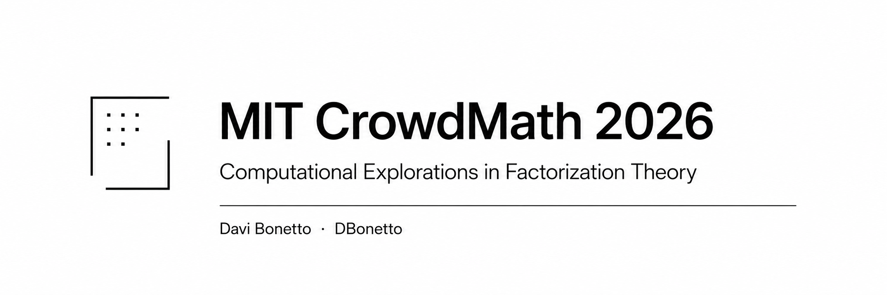

# MIT CrowdMath 2026 — Rational Semirings Research Workspace



## Overview

This repository contains my independent proof writeups and bounded computational experiments for the MIT PRIMES/CrowdMath 2026 project on arithmetic conjectures for rational semirings. The focus is on translating abstract monoid and factorization theory into clean, self-contained proofs and reproducible computational sanity checks.

The computational tooling uses exact rational arithmetic throughout — no floating-point approximations, no external numerical libraries — and every experiment clearly marks the boundary between bounded sample evidence and genuine mathematical proof.

> **This is not an official MIT, MIT PRIMES, or AoPS repository.** It is an independent student research workspace.

---

## Author

| Field           | Value                                  |
| --------------- | -------------------------------------- |
| Author          | Davi Bonetto                           |
| AoPS username   | DBonetto                               |
| Project context | MIT PRIMES/CrowdMath 2026              |
| Repository type | Independent student research workspace |

Any mistakes, interpretations, or computational limitations in this repository are my responsibility.

---

## Status

| Area                          |                Status |
| ----------------------------- | --------------------: |
| Resource 0 proof writeups     |        8 / 8 complete |
| Resource 1 proof writeups     |        8 / 8 complete |
| Computational experiments     |        8 / 8 complete |
| CSV / JSON experiment outputs |             Generated |
| Open Problem 1                | Future direction only |

---

## Mathematical Context

The CrowdMath 2026 project studies arithmetic properties of **rational semirings** and their associated **Puiseux monoids**. The central object is

$$\mathbb{N}_0[q] = \bigl\{ \, a_0 + a_1 q + a_2 q^2 + \cdots + a_n q^n \;\big|\; n \in \mathbb{N}_0,\; a_i \in \mathbb{N}_0 \bigr\}$$

for a fixed rational $q \in \mathbb{Q}_{>0}$. Equipped with addition, $\mathbb{N}_0[q]$ forms a **commutative monoid**; equipped with multiplication, $\mathbb{N}_0[q] \setminus \{0\}$ forms a multiplicative monoid $S_q$.

Key concepts studied here:

- **Atoms (irreducibles):** elements that cannot be written as a sum (or product) of two non-zero non-unit elements.
- **Unique Factorization Monoid (UFM):** every element has an essentially unique factorization into atoms.
- **Half-Factorial Monoid (HFM):** factorizations may not be unique, but all factorizations of the same element have equal length.
- **Units and associates:** units are invertible elements; two elements are associates if they differ by a unit factor. Factorization theory is always considered _up to associates_.
- **IDF (irreducible-divisor finite):** each element has only finitely many non-associate atomic divisors.
- **Grothendieck group:** the group completion of a cancellative monoid, generalizing the construction of $\mathbb{Z}$ from $\mathbb{N}_0$.
- **$p$-adic valuation $v_p$:** the exponent of a prime $p$ in a rational number, used to detect denominator structure and divisibility patterns.

The behavior of $\mathbb{N}_0[q]$ depends sharply on $q$:
for $q \in \mathbb{N}$ the monoid is a UFM;
for $q = 1/n$ the unit group is nontrivial and associate classes collapse raw divisor counts;
for $q = a/b$ with $a, b > 1$ the only unit is $1$, but factorization may still fail uniqueness.

Bounded computational experiments cannot prove these infinite-monoid properties — but they can expose structure, generate witnesses for non-uniqueness, and serve as sanity checks before working on proofs.

---

## Proof Archive

| Resource       | Exercise Range      | Status           | Folder                   | Notes                                                                          |
| -------------- | ------------------- | ---------------- | ------------------------ | ------------------------------------------------------------------------------ |
| Resource 0     | Exercises 0.1 – 0.8 | Complete         | `proofs/resource_0/`     | Preliminaries: cancellativity, Grothendieck groups, Puiseux monoids            |
| Resource 1     | Exercises 1.1 – 1.8 | Complete         | `proofs/resource_1/`     | Factorization theory: primes, atoms, HFM / UFM, atomicity of $\mathbb{N}_0[q]$ |
| Open Problem 1 | Future work         | Placeholder only | `proofs/Open Problem 1/` | No open-problem solution is claimed                                            |

---

## Computational Experiments

All experiments run from the repository root with no external dependencies.

| Experiment                                   | Main focus                                                      | Related exercises              | Output                                 |
| -------------------------------------------- | --------------------------------------------------------------- | ------------------------------ | -------------------------------------- |
| `exp_001_generate_semiring_elements.py`      | Bounded generation of $\mathbb{N}_0[q]$ and $\mathbb{N}_0[q,r]$ | Resource 0 / Resource 1 setup  | `experiments/results/exp_001_outputs/` |
| `exp_002_detect_units_in_bounded_samples.py` | Bounded unit detection in $S_q = \mathbb{N}_0[q]^\bullet$       | Exercise 1.7                   | `experiments/results/exp_002_outputs/` |
| `exp_003_group_associate_classes.py`         | Sample associate class grouping                                 | Exercise 1.7 / IDF preparation | `experiments/results/exp_003_outputs/` |
| `exp_004_bounded_factorization_search.py`    | Bounded factorization witnesses                                 | Exercise 1.7                   | `experiments/results/exp_004_outputs/` |
| `exp_005_candidate_atom_detection.py`        | Candidate additive atom detection                               | Exercise 1.8                   | `experiments/results/exp_005_outputs/` |
| `exp_006_candidate_atomic_divisors.py`       | Candidate atomic divisors of selected targets                   | IDF preparation                | `experiments/results/exp_006_outputs/` |
| `exp_007_idf_sanity_checks.py`               | Bounded IDF sanity checks; raw vs. associate-class gap          | Open Problem preparation       | `experiments/results/exp_007_outputs/` |
| `exp_008_valuation_patterns.py`              | Bounded $p$-adic valuation patterns                             | Exercises 0.8, 1.7, 1.8        | `experiments/results/exp_008_outputs/` |

### Computational Pipeline

```text
bounded generation
  → candidate atoms
  → factorization witnesses
  → unit detection
  → associate classes
  → valuation patterns
  → candidate atomic divisors
  → bounded IDF sanity checks
```

The order matters: IDF-related experiments require prior knowledge of units and associates. Without grouping associate classes first, raw divisor counts can be misleading — for example, for $q = 1/2$, ten raw candidate divisors collapse to two associate classes under the nontrivial unit group $\langle 2 \rangle$.

---

## How to Run

**Requirements:** Python 3.11 or later. No external packages.

### Option A — unified runner (recommended)

```bash
python run_all_experiments.py
```

Runs all 8 experiments in the correct dependency order, prints a summary table with pass/fail and elapsed time, and exits with code 0 on success.

> **Note:** `exp_006` (~4 min) and `exp_007` (~3 min) are computationally intensive. The runner will warn you before they start.

### Option B — run individually

```bash
# Dependency order
python experiments/exp_001_generate_semiring_elements.py
python experiments/exp_005_candidate_atom_detection.py
python experiments/exp_004_bounded_factorization_search.py
python experiments/exp_002_detect_units_in_bounded_samples.py
python experiments/exp_003_group_associate_classes.py
python experiments/exp_008_valuation_patterns.py
python experiments/exp_006_candidate_atomic_divisors.py
python experiments/exp_007_idf_sanity_checks.py
```

- All computations use exact rational arithmetic via `fractions.Fraction`. No floating-point operations are used.
- The current experiments use only the Python standard library.
- Outputs are written to `experiments/results/`.

---

## Results and Output Format

Each experiment produces:

- **CSV files** — tabular data for inspection and comparison across $q$ values.
- **JSON files** — structured output for programmatic access, including all parameters and bounded warnings.
- **`summary.md`** — a human-readable narrative with results tables and interpretations.

Every output file and summary includes an explicit bounded warning:

> _This is a bounded computational sample. It does not prove the complete structure of the infinite monoid._

The outputs are intended for inspection, comparison, and sanity-checking. They are not substitutes for proofs.

---

## What This Repository Does Not Claim

- This is not an official MIT, MIT PRIMES, or AoPS repository.
- This repository does not claim to solve Open Problem 1.
- Bounded computational experiments do not prove infinite mathematical statements.
- Candidate atoms, candidate divisors, and bounded IDF checks are sample-based results unless separately established by proof.
- This repository is not a peer-reviewed publication.
- Participation in CrowdMath does not imply direct mentorship, endorsement, or affiliation beyond public participation in the project.
- Any use of "MIT PRIMES/CrowdMath" is contextual attribution, not branding or endorsement.

---

## Repository Structure

```text
MIT-CrowdMath-2026/
├── assets/
│   └── banner.png
├── proofs/
│   ├── resource_0/          # Exercises 0.1 – 0.8
│   ├── resource_1/          # Exercises 1.1 – 1.8
│   └── Open Problem 1/      # placeholder
├── experiments/
│   ├── exp_001_generate_semiring_elements.py
│   ├── exp_002_detect_units_in_bounded_samples.py
│   ├── exp_003_group_associate_classes.py
│   ├── exp_004_bounded_factorization_search.py
│   ├── exp_005_candidate_atom_detection.py
│   ├── exp_006_candidate_atomic_divisors.py
│   ├── exp_007_idf_sanity_checks.py
│   ├── exp_008_valuation_patterns.py
│   └── results/             # CSV + JSON + summary.md per experiment
├── src/
│   └── crowdmath2026/
│       ├── rationals.py
│       ├── semirings.py
│       ├── experiments.py
│       ├── factorization.py
│       ├── units.py
│       ├── associates.py
│       ├── valuations.py
│       ├── atomic_divisors.py
│       └── idf.py
├── run_all_experiments.py
├── pyproject.toml
├── LICENSE
└── README.md
```

Private planning files are excluded from version control.

---

## Future Work

- Audit proof files for readability and notation consistency.
- Prepare an Open Problem 1 thread map and background summary.
- Extend $\mathbb{N}_0[q, r]$ computations beyond the current two-variable baseline.
- Improve target selection heuristics for IDF sanity checks.
- Add a unified experiment runner script.

No open-problem progress is implied beyond computational preparation.

---

## License

This repository is released under the MIT License. See [`LICENSE`](LICENSE).

---

## Acknowledgment

This work is based on public materials and discussions from MIT PRIMES/CrowdMath 2026 and Art of Problem Solving. This repository is independent and unofficial.
